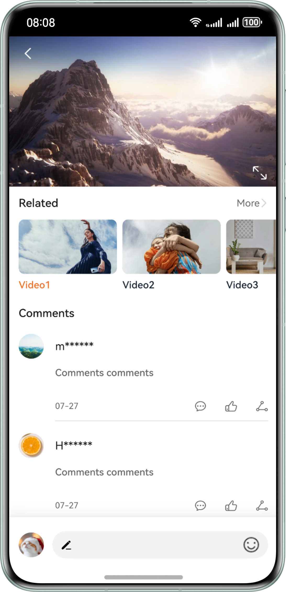
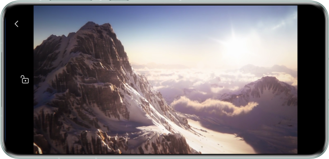

# Video Landscape/Portrait Mode Switching

## Overview

This sample implements the function of automatically switching between landscape and portrait modes during video playback.

## Preview

| Portrait                                                    | Landscape                                              |
|-------------------------------------------------------------|--------------------------------------------------------|
|  |  |

## How to Use

1. Pull down the status bar to disable rotation lock. Open the app, go to the video playback details screen, and rotate your phone to landscape orientation or touch the icon in the lower right corner of the video. The video is played in full screen.

2. During full-screen video playback, touch the back icon in the upper left corner or change your phone from landscape to portrait. The video exits full screen mode.

3. During full-screen video playback, touch the lock icon in the middle of the left screen to lock rotation. The video playback is locked in place and does not rotate when you rotate your screen. When you touch the unlock icon to disable rotation lock, the video will rotate with the screen.

## Project Directory

```
├──entry/src/main/ets
│  ├──common 
│  │  ├──AnimationProperties.ets          // Property Animation Helper Class
│  │  ├──CustomTransition.ets             // Custom Transition Animation Manager
│  │  ├──Logger.ets                       // Log Printer Class
│  │  └──VideoNodeController.ets          // Video Component Custom Node Management Class   
│  ├──entryability
│  │  └──EntryAbility.ets                 // Entry ability lifecycle callbacks
│  ├──entrybackupability 
│  │  └──EntryBackupAbility.ets           // Application data backup and restore class
│  ├──model 
│  │  ├──CommentModel.ets                 // Comment Model
│  │  └──RelatedModel.ets                 // Related list model
│  ├──pages
│  │  └──Index.ets                        // App Home
│  ├──transitionbetweenpage               // Page-level video playback switch directory
│  │  ├──DetailPlay.ets                   // Video Details Page
│  │  ├──LandscapePlay.ets                // Full-screen video playback page
│  │  └──VideoPlay.ets                    // Video Component Custom Node Management Class
│  ├──transitioninpage                    // Switch video playback directory between pages
│  │  ├──VideoDetail.ets                  // Video details page       
│  │  └──VideoPlayView.ets                // Video player component
│  │──utils                  
│  │  ├──AVPlayerUtil.ets                 // Video Playback Utility
│  │  ├──ComponentAttrUtils.ets           // Component Information Utility Class
│  │  └──WindowUtils.ets                  // Window Utility Class
│  └──views                 
│     ├──BottomView.ets                   // Bottom action bar component
│     ├──CommentsView.ets                 // Comment List Component
│     └──RelatedListView.ets              // Related Videos Component
└──entry/src/main/resources               // Application Static Resources Directory
```

## How to Implement

* The video playback feature is encapsulated in **AVPlayerUtil.ets**. For details about the source code, see [AVPlayerUtil.ets](entry/src/main/ets/utils/AVPlayerUtil.ets).

* For details about the source code for landscape/portrait mode, see [VideoPlayView.ets](entry/src/main/ets/transitioninpage/VideoPlayView.ets).
  The [https://developer.huawei.com/consumer/en/doc/harmonyos-references/js-apis-window#setpreferredorientation9-1) method of the **Window** object is used for switching between landscape and portrait modes.
  

## Required Permissions

N/A

## Dependencies

N/A

## Constraints

1. The sample is only supported on Huawei phones with standard systems.
2. The HarmonyOS version must be HarmonyOS 5.0.5 Release or later.
3. The DevEco Studio version must be DevEco Studio 5.0.5 Release or later.
4. The HarmonyOS SDK version must be HarmonyOS 5.0.5 Release SDK or later.
