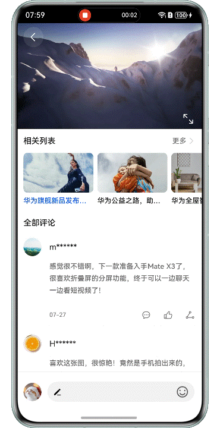

# 实现视频横竖屏切换功能

## 介绍

本示例基于媒体播放[AVPlayer](https://developer.huawei.com/consumer/cn/doc/harmonyos-references/arkts-apis-media-avplayer)、窗口方向设置[setPreferredOrientation](https://developer.huawei.com/consumer/cn/doc/harmonyos-references/arkts-apis-window-window#setpreferredorientation9-1)、Navigation的自定义导航转场动画([customNavContentTransition](https://developer.huawei.com/consumer/cn/doc/harmonyos-references/ts-basic-components-navigation#customnavcontenttransition11))等能力、实现了一个视频播放应用，分别实现了页面内和页面级两种视频播放的横竖屏切换效果。其中页面内横竖屏切换是在当前页面，动态改变窗口方向来实现横竖屏切换；页面级横竖屏切换是在当前页面，跳转到新的页面实现横竖屏切换，该页面为横屏显示。


## 效果预览

| 页面内横竖屏切换                                              | 页面间横竖屏切换                                               | 
|-------------------------------------------------------|--------------------------------------------------------|
|  |  |

## 使用说明
1. 点击应用首页底部的“页面横屏播放”和“页面级横竖屏”播放按钮，分别跳转到对应场景的视频播放详情页面。
2. 页面内视频播放横竖屏切换：在视频竖屏播放的情况下（视频播放详情页），点击右下角的全屏图标，窗口会旋转到横屏状态，视频会跟着旋转并且铺满屏幕。
3. 页面级视频播放横竖屏切换：在视频竖屏播放的情况下（视频播放详情页），点击右下角的全屏图标，会跳转到新的页面（视频播放页面），该页面为横屏显示，同时视频会跟着旋转并且铺满屏幕。此外页面在跳转过程中会有“一镜到底”的显示动画效果，详情页的播放视图会旋转放大过渡到播放页面。
4. 在状态栏工具栏中的“旋转锁定”开关未打开的情况下，在视频详情页旋转屏幕到横屏，视频会自动旋转为横屏播放。

## 目录结构

```
├──entry/src/main/ets
│  ├──common 
│  │  ├──AnimationProperties.ets          // 属性动画辅助类  
│  │  ├──CustomTransition.ets             // 自定义转场动画管理类
│  │  ├──Logger.ets                       // 日志打印类
│  │  └──VideoNodeController.ets          // 视频组件自定义节点管理类     
│  ├──entryability
│  │  └──EntryAbility.ets                 // Ability的生命周期回调内容
│  ├──entrybackupability 
│  │  └──EntryBackupAbility.ets           // 数据备份恢复类
│  ├──model 
│  │  ├──CommentModel.ets                 // 评论模型
│  │  └──RelatedModel.ets                 // 相关列表模型
│  ├──pages
│  │  └──Index.ets                        // 应用首页
│  ├──transitionbetweenpage               // 页面级视频播放切换目录
│  │  ├──DetailPlay.ets                   // 视频详情页     
│  │  ├──LandscapePlay.ets                // 全屏视频播放页面    
│  │  └──VideoPlay.ets                    // 视频组件自定义节点管理类     
│  ├──transitioninpage                    // 页面间视频播放切换目录
│  │  ├──VideoDetail.ets                  // 视频详情页       
│  │  └──VideoPlayView.ets                // 视频播放组件
│  │──utils                  
│  │  ├──AVPlayerUtil.ets                 // 视频播放工具类
│  │  ├──ComponentAttrUtils.ets           // 获取组件信息工具类
│  │  └──WindowUtils.ets                  // 窗口工具类
│  └──views                 
│     ├──BottomView.ets                   // 底部操作栏组件
│     ├──CommentsView.ets                 // 评论列表组件
│     └──RelatedListView.ets              // 视频相关推荐组件
└──entry/src/main/resources               // 应用静态资源目录
```

## 具体实现

* 视频播放功能基于AVPlayer实现，具体参考：[使用AVPlayer播放视频(ArkTS)](https://developer.huawei.com/consumer/cn/doc/harmonyos-guides/video-playback)。
* 页面内视频播放横竖屏切换：使用了window对象的[setPreferredOrientation](https://developer.huawei.com/consumer/cn/doc/harmonyos-references/arkts-apis-window-window#setpreferredorientation9-1)
  方法;
* 页面级视频播放横竖屏播放：使用了Navigation的自定义导航转场动画能力（[customNavContentTransition](https://developer.huawei.com/consumer/cn/doc/harmonyos-references/ts-basic-components-navigation#customnavcontenttransition11)），结合[属性动画](https://developer.huawei.com/consumer/cn/doc/harmonyos-guides/arkts-animation-attribute)来实现。

## 相关权限

不涉及

## 依赖

不涉及。

## 约束与限制

1. 本示例仅支持标准系统上运行，支持设备：华为手机。
2. HarmonyOS系统：HarmonyOS 6.0.2 Release及以上。
3. DevEco Studio版本：DevEco Studio 6.0.2 Release及以上。
4. HarmonyOS SDK版本：HarmonyOS 6.0.2 Release SDK及以上。